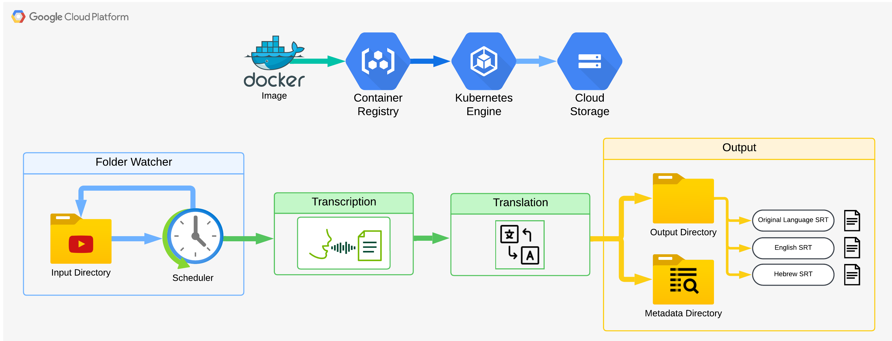

# Automated Video Transcription and Translation

This project provides an automated solution for transcribing video files to subtitles in the original language, English, and Hebrew. It leverages AI models for transcription and translation, ensuring high accuracy and scalability for subtitle generation.

## Description

This solution is designed to streamline the transcription and translation of video files in a scalable and automated manner. By integrating advanced AI models like OpenAI Whisper for transcription and MarianMT for multilingual translation, the system ensures high-quality subtitle generation. 

The pipeline operates within a Kubernetes environment, enabling parallel processing of multiple files for maximum efficiency. A watch folder functionality ensures that only new and unprocessed videos are detected and handled, while the integration with Google Cloud Storage (GCS) facilitates input/output file management. With automated scheduling and customizable parameters, this system is ideal for applications that require regular and reliable transcription and translation of multimedia content.

---------------------------------------------------------------------------------



## Features
- **Automatic Transcription:** Transcribes videos into the original language using OpenAI Whisper.
- **Multilingual Translation:** Automatically translates the original transcription to English and Hebrew using MarianMT models.
- **Watch Folder Functionality:**
  - Continuously monitors a GCS input directory to detect new video files.
  - Ensures that only unprocessed files are picked up for transcription and translation.
- **Scalable and Efficient Processing:**
  - Processes multiple videos in parallel using Kubernetes pods.
  - Automated scheduling with Kubernetes CronJob for daily processing.
- **Cloud Integration:**
  - Input and output file management via Google Cloud Storage (GCS).
  - Metadata tracking to prevent duplicate processing.
- **Customizable Settings:**
  - Adjustable transcription and translation parameters.
  - Configurable processing intervals and resource allocation.

---

## Prerequisites
- **Environment Requirements:**
  - Kubernetes cluster for deployment.
  - GCS bucket for storing input/output files and metadata.
  - Service account with appropriate permissions.
  - Pre-installed `FFmpeg` for audio extraction in the Docker container.
- **Dependencies:**
  - Docker for building and deploying containerized applications.
  - Python libraries (defined in `requirements.txt`):
    - `torch`, `transformers`, `librosa`, `google-cloud-storage`, etc.
  - OpenAI Whisper for transcription and MarianMT for translation.

---

## Setup and Deployment

### 1. Clone the Repository
```bash
git clone <repository-url>
cd <repository-folder>
```

### 2. Configure Environment Variables
Set the following environment variables:   

**BUCKET_NAME:** Name of the GCS bucket.   
**INPUT_PREFIX:** Input directory in the GCS bucket.   
**OUTPUT_PREFIX:** Output directory in the GCS bucket.   
**METADATA_PREFIX:** Metadata directory in the GCS bucket.   

### 3. Build and Push Docker Image
Run the provided script to build and upload the Docker image:   

```bash
./build_and_push.sh
```

### 4. Deploy on Kubernetes
Modify the cronjob.yaml file to include your Docker image and environment variables, then deploy using:   

```bash
kubectl apply -f cronjob.yaml
```

### Customization   
**Transcription Settings:**      
- Modify parameters in AudioProcessor within transcriber.py to adjust transcription behavior.   
- Default Whisper model: turbo.   

**Translation Settings:**     
- Default target languages: en (English) and he (Hebrew).   
- Customize translation parameters in translator.py.   

### Workflow

**Video File Detection:** Scans the GCS input directory for new video files.   
**Audio Extraction:** Extracts audio from video using FFmpeg.   
**Transcription:** Generates subtitles in the original language using OpenAI Whisper.   
**Translation:** Converts subtitles to English and Hebrew.   
**Output Storage:** Uploads generated SRT files to the GCS output directory.   
**Metadata Update:** Tracks processed files to prevent duplicate processing.   

### Example Commands   
Run Locally for Testing    
```bash
python main.py
```
   
View Logs   
Access the logs stored in the metadata directory:   
```bash
gsutil cat gs://<BUCKET_NAME>/<METADATA_PREFIX>/logs/<DATE>_processing_log.json
```

